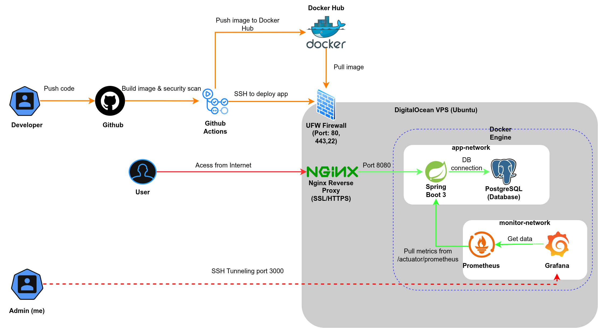
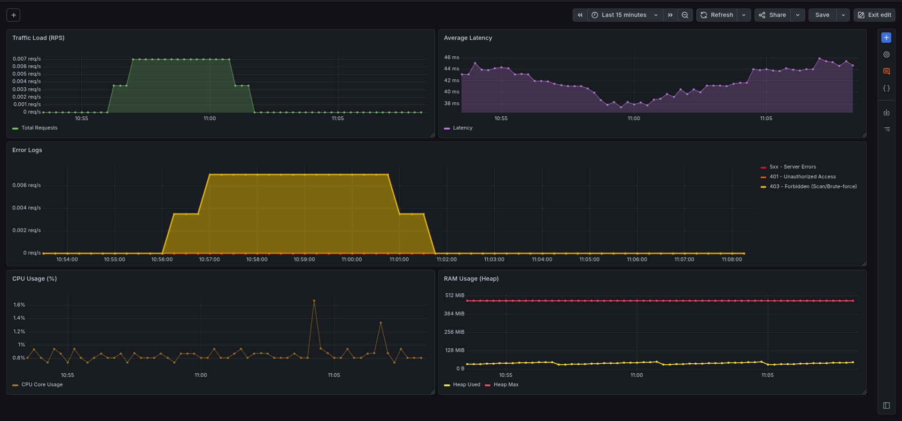
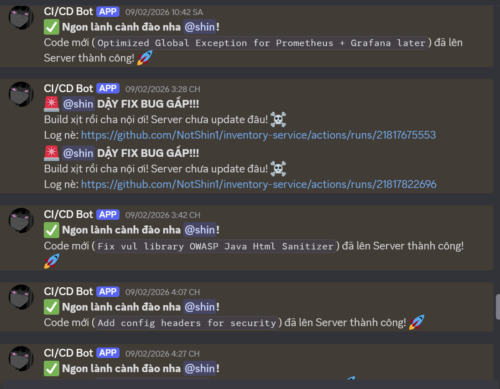

# 📦 Inventory Service - DevSecOps Integrated Application

> **Status:** 🟢 Production | **CI/CD:** Active | **Security:** Hardened

An enterprise-grade Inventory Management RESTful API built with **Java Spring Boot**, fully integrated with a **DevSecOps pipeline** for automated security scanning, monitoring, and zero-downtime deployment.

---

## 🏗️ Architecture Design

*System architecture showcasing CI/CD flow, Network Isolation (Docker), and Secure Monitoring via SSH Tunneling.*

---

## 📊 Monitoring & Alerting

| System Health (Grafana) | CI/CD Pipeline (GitHub Actions) |
|:-------------------------:|:-----------------------------:|
|  |  |
| *Real-time metrics: CPU, RAM, HTTP Logs (401/403 detection)* | *Automated Build, Test, Trivy Scan & Discord Alert* |

---

## 🛠️ Tech Stack & Tools

* **Core Backend:** Java 21, Spring Boot 3, Hibernate/JPA.
* **Database:** PostgreSQL (Dockerized).
* **Security:** Spring Security, JWT (Access + Refresh Token), BCrypt.
* **Infrastructure:** Docker, Docker Compose, Nginx (Reverse Proxy & SSL).
* **DevOps & CI/CD:**
  * **Pipeline:** GitHub Actions.
  * **Container Registry:** Docker Hub.
  * **Security Scanning:** Trivy (Container & OS vulnerabilities).
  * **Notification:** Discord Webhook.
* **Observability:**
  * **Metrics:** Prometheus.
  * **Visualization:** Grafana (Custom Dashboards).

---

## 🛡️ Key Features (DevSecOps Highlights)

This project focuses on **Security Hardening** and **Operational Excellence** beyond standard CRUD operations.

### 🔒 1. Security Hardening
* **Anti-Brute Force:** Implemented purposeful login delay (1s) to mitigate timing attacks and brute-force attempts.
* **Rate Limiting:** Integrated **Bucket4j** to prevent DDoS and API spamming at the application level.
* **Malware Protection:** Secure file upload validation (Magic Numbers check) to block executable files disguised as images.
* **IDOR Prevention:** Service-level authorization logic to ensure users can only access their own data.
* **Secure Headers:** HSTS, X-Frame-Options (Deny), XSS Protection enabled.

### ⚙️ 2. CI/CD Pipeline (Automated)
* **Automated Testing:** Unit Tests run on every push.
* **Vulnerability Gating:** Pipeline fails immediately if **Trivy** detects `HIGH` or `CRITICAL` vulnerabilities in the Docker image.
* **Smart Deployment:** Uses `ssh-action` to deploy to DigitalOcean VPS via Docker Compose without downtime (recreating app container only).
* **Alerting:** Real-time notifications to Discord for Build Success/Failure logs.

### 👁️ 3. Observability & Operations
* **Centralized Monitoring:** Dashboard tracking Request Rate, Latency, Error Rates (4xx, 5xx), JVM Heap, and CPU usage.
* **Intrusion Detection:** Visualized logs for unauthorized login attempts (401 spikes) and forbidden access (403).
* **Disaster Recovery:** Automated Cronjob script to backup PostgreSQL database every night (retention policy: 7 days).

---

## 🚀 How to Run Locally

### Prerequisites
* Docker & Docker Compose installed.
* Java 21 (Optional if running via Docker).

### Quick Start
```bash
# 1. Clone the repository
git clone [https://github.com/NotShin1/inventory-service.git](https://github.com/NotShin1/inventory-service.git)
cd inventory-service

# 2. Configure Environment Variables
# Create a .env file based on the example provided
cp .env.example .env

# 3. Start the stack (App + DB + Prometheus + Grafana)
docker-compose up -d

# 4. Access the application
# App API: http://localhost:8080
# Grafana: http://localhost:3000 (Default user: admin/admin123)